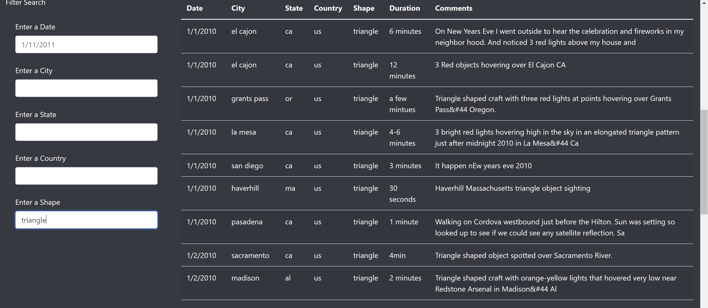

# UFO-s
Javascript, Bootstrap

## Overview of Project:

The purpose of the analysis is to create a website with UFO sightings information. On this website there is a way to filter out the information based on different categories: the date of the sighting, the location of the sighting by city, state or country and by the shape of the sighting. This would allow a person that is interested in the sighting information to fine tune their search to what suits them best. They can use only one filter or they can combine different categories. 

---

## Link to JavaScript Code

## Link to html Code

Image for header, data.js file, and css code are available in the Git Hub folder. 

---

## Results:

The results of this analysis allow a person to search the UFO sightings in several different ways. Below is a description of the search process with example images. 

As you conduct the search you begin with all the data in the table:

### All Data No Filters

You can search seapartely by any one of the categories:

### Search by Date

---

### Search by City

---

### Search by State

---

### Search by Country

---

### Search by Shape

---

Or you can combine searches. For example, here is an image of a search by date January 1st, 2010, state CA, country US and shape light. this returns a list of all the sightings that belong to all of these categories. 

### Search by Combined

---

## Summary: 

This design is useful for searching the categories mentioned with the following drawbacks and recommendations for improvement:
1. The table does not have a title. It should be relatively easy to fix and even though it is easy to understand the purpose of the table it is still always good to be explicit. 
2. The current version of the code is using a static file of data for the sightings. For this to be really useful it would be nice to update the data on an ongoing basis. Either the website author update the data or even let users update the data. 
3. It would be useful to search the comments as well. This may require a more complex way to search such as for similar meaning or synonyms because people could describe the same thing in more than one way. But adding this would potentially help in connecting the different sightings to understand if any of them could be the same thing that multiple people, possibly in multiple locations, saw. 
